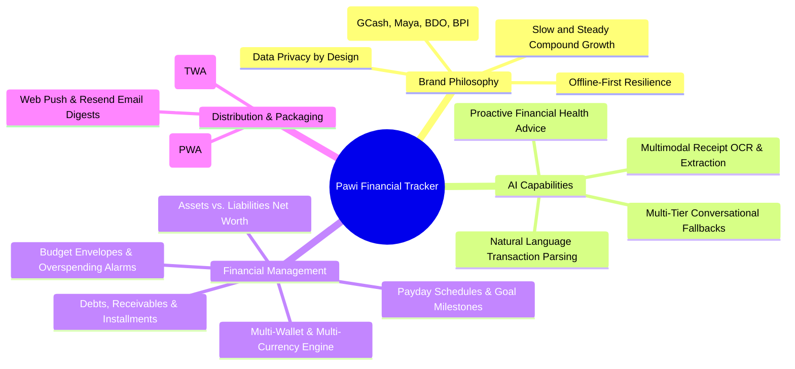
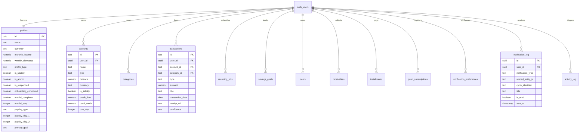
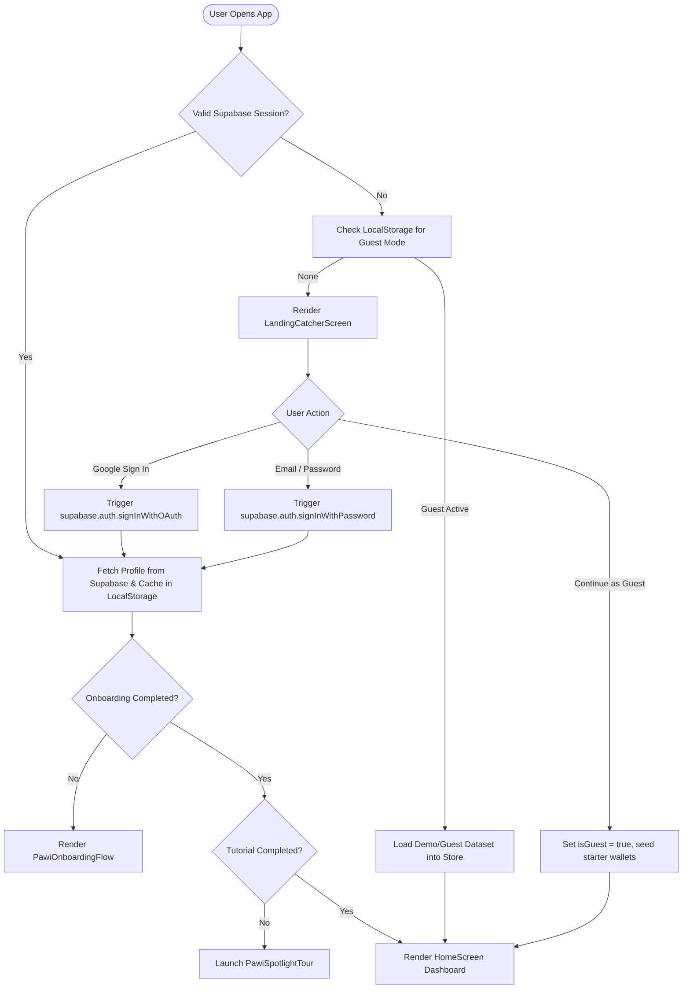
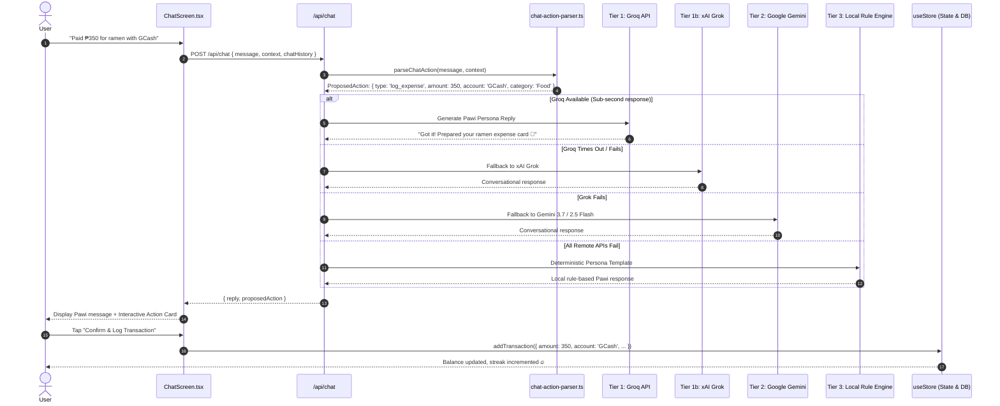
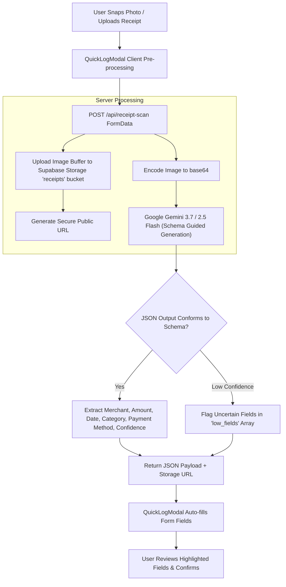
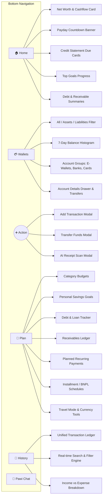
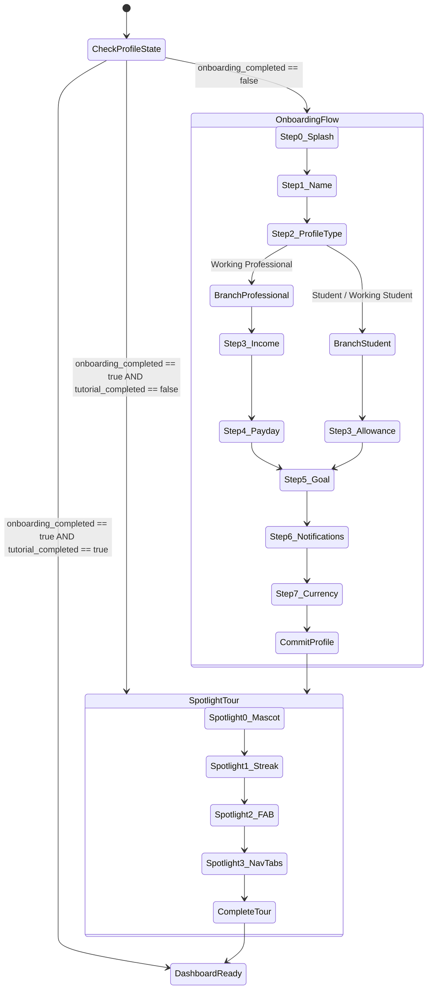
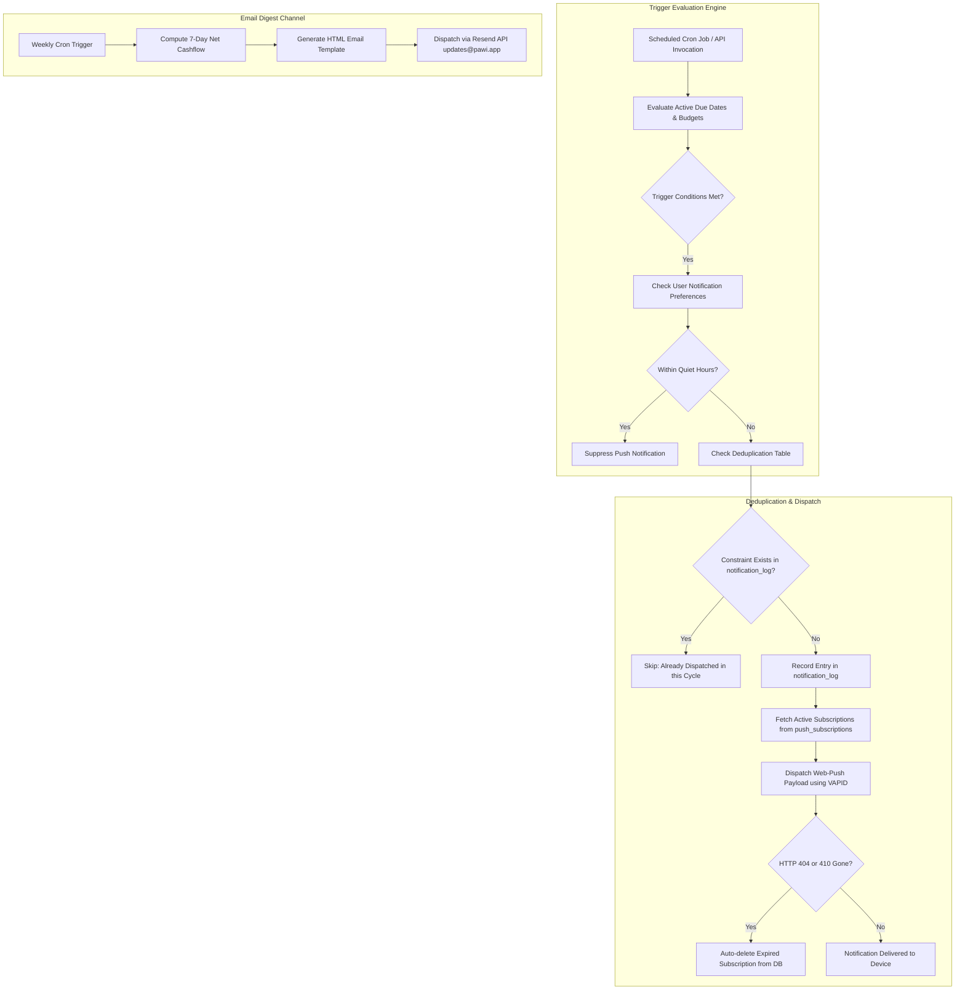
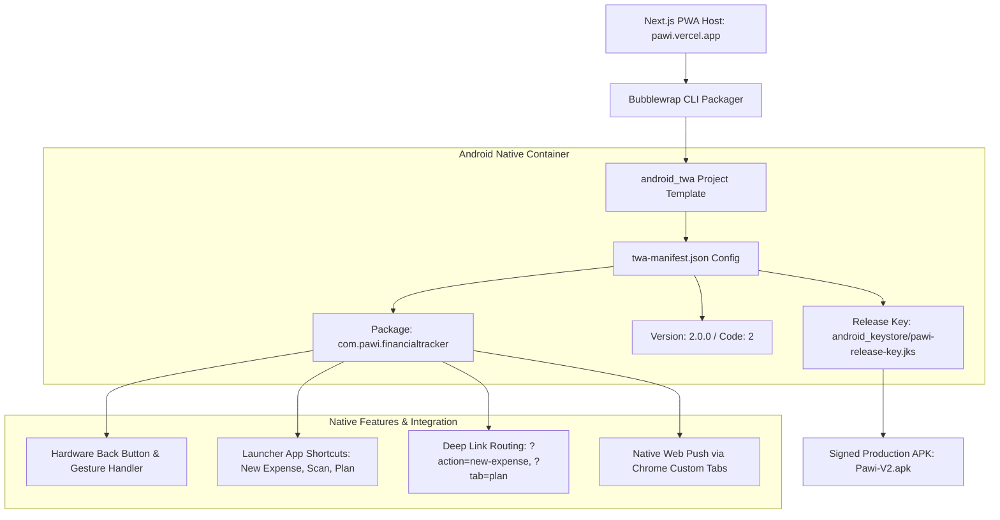

# 🐢 Pawi: AI-Powered Personal Finance Tracker — Complete Project Architecture & Knowledge Base

> [!INFO] **Obsidian Document Metadata**
> - **Project**: Pawi Financial Tracker (formerly Sentimo)
> - **Mascot**: Pawi the Pawikan (Sea Turtle) — *"Save smarter, slow and steady"*
> - **Primary Target Market**: Philippines / Southeast Asia & Global (PHP, USD, EUR, GBP, JPY)
> - **Platforms**: Next.js 16 (PWA), Android TWA (APK), Vanilla Web App (Firebase)
> - **Backend / DB**: Supabase (PostgreSQL 15 + RLS + Storage) & Firebase Firestore
> - **AI Systems**: Tiered AI (Groq LLaMA 3.3 / Qwen 2.5 ➔ xAI Grok ➔ Google Gemini 3.7 Flash ➔ Local Deterministic NLP)
> - **Deployment**: Vercel (`pawi.vercel.app`), Firebase Hosting (`pawi-budget-tracker.web.app`)

---

## 📑 Table of Contents
1. [[#1. Executive Summary & Brand Identity]]
2. [[#2. System Architecture & High-Level Topology]]
3. [[#3. Dual-Stack Repository Structure]]
4. [[#4. Database Architecture & PostgreSQL Schema (Supabase)]]
5. [[#5. Authentication & User Session Lifecycle]]
6. [[#6. AI Systems & Conversational Action Engine]]
7. [[#7. Multimodal AI Receipt Scanner (OCR)]]
8. [[#8. Core Financial Engines & Math Models]]
9. [[#9. Frontend UI / UX Screen Breakdown (Next.js)]]
10. [[#10. User Journey: Onboarding & Spotlight Tutorial]]
11. [[#11. Push Notification & Email Digest Systems]]
12. [[#12. Security, Admin Governance & RLS Rules]]
13. [[#13. Android TWA Packaging & Native Integration]]
14. [[#14. Testing Suite & Quality Assurance]]
15. [[#15. Environment Variables & Deployment Guide]]

---

## 1. Executive Summary & Brand Identity

> [!NOTE] **Core Philosophy**
> **Pawi** transforms personal finance from a stressful chore into a gamified, empowering daily routine. Built around the symbolism of the Philippine sea turtle (*pawikan*), Pawi reinforces the principle of **slow, steady, compound wealth accumulation**.



### Key Brand Tenets
- **Local Institution Integration**: Built-in visual branding and color palettes for GCash, Maya, BDO, BPI, UnionBank, GoTyme, Wise, SeaBank, RCBC, and Metrobank.
- **Offline-First & Local Caching**: Works seamlessly without internet via `localStorage` and IndexedDB; auto-syncs to Supabase PostgreSQL upon reconnection.
- **Actionable AI Chat**: Chatting with Pawi isn't just advisory—Pawi can parse commands like *"Paid ₱250 for McDonald's lunch using GCash"* and present interactive confirmation cards that commit directly to the ledger.

---

## 2. System Architecture & High-Level Topology

Pawi features a dual-stack setup:
1. **Modern Flagship Application (`/mobile_app`)**: Next.js 16 + React 19 + TypeScript + Supabase + Groq/Gemini AI + Android TWA.
2. **Legacy/Static Dashboard (`/` root)**: Vanilla HTML5, CSS3, ES Modules, Firebase Firestore, and an Express proxy server.

```mermaid
graph TD
    subgraph Client Layer
        A1[Android Device - APK / TWA]
        A2[Mobile / Desktop Browser - PWA]
        A3[Legacy Static Web Client]
    end

    subgraph API & Gateway Layer (Vercel Edge / Serverless)
        B1["/api/chat (Groq -> Grok -> Gemini -> Rule Engine)"]
        B2["/api/receipt-scan (Gemini Multimodal OCR)"]
        B3["/api/push/* (Web-Push Dispatcher & Dedupe)"]
        B4["/api/email/weekly-digest (Resend Transactional Engine)"]
        B5["/api/admin/* (RBAC Guarded API)"]
        B6["Express Server :3000 (Legacy Gemini Proxy)"]
    end

    subgraph AI Intelligence Layer
        C1["Tier 1: Groq API (LLaMA 3.3 70B / Qwen)"]
        C2["Tier 1b: xAI Grok (grok-2-latest)"]
        C3["Tier 2: Google Gemini (3.7 / 2.5 / 2.0 Flash)"]
        C4["Tier 3: Local Deterministic NLP Rule Engine"]
    end

    subgraph Persistence & Infrastructure Layer
        D1[("Supabase PostgreSQL (RLS, Triggers, Functions)")]
        D2[("Supabase Storage ('receipts' bucket)")]
        D3[("Firebase Firestore (Legacy Database)")]
        D4["Web Push Service (Google FCM / Mozilla Push)"]
        D5["Resend Email Delivery API"]
    end

    A1 -->|Deep Links & Fetch| B1 & B2 & B3
    A2 -->|Next.js App Router| B1 & B2 & B3 & B4 & B5
    A3 -->|HTTP Fetch| B6
    A3 -->|Direct Firebase SDK| D3

    B1 --> C1 --> C2 --> C3 --> C4
    B2 --> C3
    B2 --> D2
    B1 & B3 & B4 & B5 --> D1
    B3 --> D4
    B4 --> D5
```

---

## 3. Dual-Stack Repository Structure

```
Pawi-FinancialTracker/
├── mobile_app/                     # 🚀 MODERN FLAGSHIP (Next.js 16 + React 19)
│   ├── app/
│   │   ├── admin/                  # Admin portal (/admin, /admin/users, /admin/activity)
│   │   │   ├── layout.tsx          # Strict security & admin shell
│   │   │   └── page.tsx            # KPI analytics, user table, audit log
│   │   ├── api/                    # Serverless API routes
│   │   │   ├── admin/              # User suspension & telemetry APIs
│   │   │   ├── chat/route.ts       # 4-tier conversational AI endpoint
│   │   │   ├── email/weekly-digest # Automated email recap via Resend
│   │   │   ├── push/               # Web push subscription, preferences & triggers
│   │   │   └── receipt-scan/       # Gemini 3.7 Flash Multimodal OCR
│   │   ├── globals.css             # Tailwind v4 theme & CSS variables
│   │   ├── layout.tsx              # Root HTML, fonts, PWA metadata, ThemeProvider
│   │   └── page.tsx                # Master client router & navigation controller
│   ├── components/
│   │   ├── plan/                   # Financial planning sub-screens
│   │   │   ├── plan-budgets-screen.tsx      # Category budget limits & spent meters
│   │   │   ├── plan-debt-screen.tsx         # Debt ledger (lenders, interest, paydown)
│   │   │   ├── plan-goals-screen.tsx        # Savings goals & milestones
│   │   │   ├── plan-installments-screen.tsx # Buy-Now-Pay-Later (BNPL) credit tracker
│   │   │   ├── plan-overview-screen.tsx     # Consolidated financial roadmap
│   │   │   ├── plan-payments-screen.tsx     # Recurring bills & planned payments
│   │   │   ├── plan-receivables-screen.tsx  # Money lent to others
│   │   │   ├── plan-tags-screen.tsx         # Custom transaction tagging
│   │   │   ├── plan-tools-screen.tsx        # Compound interest & loan calculators
│   │   │   └── plan-travel-screen.tsx       # Live currency converter & travel mode
│   │   ├── screens/                # Core bottom-nav screens
│   │   │   ├── chat-screen.tsx              # Pawi conversational assistant
│   │   │   ├── history-screen.tsx           # Searchable transaction ledger
│   │   │   ├── home-screen.tsx              # Net worth, quick stats, widgets
│   │   │   ├── login-screen.tsx             # OAuth & Email authentication
│   │   │   ├── plan-screen.tsx              # Hub router for planning tools
│   │   │   └── wallets-screen.tsx           # Multi-wallet & asset/liability manager
│   │   ├── pawi-onboarding-flow.tsx         # Branching 7-step onboarding wizard
│   │   ├── pawi-spotlight-tour.tsx          # SVG cutout interactive product tour
│   │   ├── quick-log-modal.tsx              # Camera / AI receipt scan modal
│   │   ├── transaction-entry-modal.tsx      # Manual income/expense entry modal
│   │   └── transfer-modal.tsx               # Inter-wallet balance transfer modal
│   ├── lib/                        # Shared business logic, state & utilities
│   │   ├── __tests__/              # 11 Jest test suites
│   │   ├── admin-auth.ts           # Strict RBAC guard for janvermanlapaz@gmail.com
│   │   ├── auth-context.tsx        # Supabase auth session & guest mode state
│   │   ├── chat-action-parser.ts   # Deterministic regex & NLP intent parser
│   │   ├── email.ts                # Resend HTML email template generator
│   │   ├── home-sections-engine.ts # Net worth & due-date calculation engine
│   │   ├── pawi-data.ts            # Type definitions, starter data, brand colors
│   │   ├── push-engine.ts          # Web-push dispatcher & dead subscription cleanup
│   │   ├── push-types.ts           # Notification trigger algorithms & quiet hours
│   │   ├── store.tsx               # Master React context & Supabase persistence
│   │   ├── supabase.ts             # Supabase client singletons (Anon + Service Role)
│   │   └── use-profile.ts          # User profile synchronization hook
│   └── supabase/migrations/        # 9 PostgreSQL schema migrations
│
├── android_twa/                    # 📱 ANDROID TRUSTED WEB ACTIVITY (TWA)
│   ├── app/build.gradle            # Native Gradle build config
│   ├── twa-manifest.json           # Bubblewrap TWA specification
│   └── setup-icons.ps1             # Android mipmap icon generator
│
├── js/                             # 🏛️ LEGACY STATIC CLIENT (Vanilla ES Modules)
│   ├── app.js                      # Application lifecycle & view switching
│   ├── auth.js                     # Firebase Authentication wrapper
│   ├── db.js                       # Firestore CRUD abstraction layer
│   ├── firebase-config.js          # Firebase SDK initialization
│   ├── nlp-parser.js               # Legacy natural language parser
│   └── store.js                    # In-memory store & IndexedDB caching
│
├── server/                         # 🔌 LEGACY PROXY BACKEND
│   └── index.js                    # Express proxy server for Gemini API
│
└── firebase.json                   # Firebase Hosting configuration
```

---

## 4. Database Architecture & PostgreSQL Schema (Supabase)

Pawi uses **PostgreSQL 15** with Row-Level Security (RLS) enabled on all public tables. Every record belongs to an authenticated user (`user_id uuid REFERENCES auth.users(id)`).



### Table Breakdown
1. **`profiles`**: User metadata, financial archetypes (`student`, `working_student`, `professional`), income, payday configuration, onboarding/tutorial step counters, and admin/suspension flags.
2. **`accounts`**: Wallets and financial accounts. Supports liquid assets (Cash, Savings, E-wallets) and liabilities (Credit Cards, Personal Loans). Stores credit limits, used credit, interest rates, and statement due days.
3. **`categories`**: Budget categories (Food, Groceries, Shopping, Bills, Entertainment) with monthly spending targets and real-time spent tracking.
4. **`transactions`**: The double-entry cashflow ledger. Contains amount, currency, kind (`income`, `expense`, `transfer`), merchant, category, tags, receipt URL (pointing to Supabase Storage), and OCR confidence.
5. **`debts`**: Money the user owes to lenders or institutions. Tracks total balance, monthly amortization, due dates, and interest rates.
6. **`receivables`**: Money owed *to* the user by friends, clients, or employers, with status tracking (`pending`, `received`, `overdue`).
7. **`installments`**: Buy-Now-Pay-Later (BNPL) or credit card installment plans (e.g., 12-month gadget purchase), tracking months total, months paid, and remaining balance.
8. **`recurring_bills`**: Utility bills, rent, and subscriptions with billing frequencies, reminder lead-times, and flexible due dates.
9. **`savings_goals`**: Sinking funds (Emergency Fund, Travel, Tech) tracking target amount vs. current saved balance.
10. **`push_subscriptions`**: Web Push subscription endpoints and crypto keys (`p256dh`, `auth`) tagged by platform (`web` or `android`).
11. **`notification_preferences`**: Granular toggles per notification type (overdue alerts, budget thresholds, quiet hours).
12. **`notification_log`**: Deduplication registry enforcing unique constraints on `(user_id, notification_type, related_entity_id, cycle_identifier)`.
13. **`admin_users` & `admin_settings`**: RBAC permissions and global application feature flags.

### Database Triggers
- **`handle_new_user()`**: Triggered automatically on `AFTER INSERT ON auth.users`. Auto-provisions a default profile and seeds starter accounts (`GCash` and `BDO` at ₱0.00).
- **`handle_admin_assignment()`**: Triggered on `auth.users`. Automatically grants `is_admin = true` if the email matches `janvermanlapaz@gmail.com`.

---

## 5. Authentication & User Session Lifecycle

Pawi supports a multi-modal authentication model implemented in `auth-context.tsx`:



### Guest Mode Architecture
To preserve user privacy and reduce friction, users can explore the app immediately in **Guest Mode**. Guest data is stored entirely in memory and `localStorage`, bypassing Supabase network calls while maintaining full feature parity.

---

## 6. AI Systems & Conversational Action Engine

Pawi features an enterprise-grade, **4-Tier Fallback Architecture** in `/api/chat/route.ts` combined with a client-safe deterministic NLP parser in `chat-action-parser.ts`.



### Supported Conversational Action Intents
- **`log_expense`**: Logs single or multi-item expenses.
- **`log_income`**: Records salary, freelance payouts, or cash-in events.
- **`pay_bill`**: Matches planned bills and records payment against the designated wallet.
- **`pay_installment`**: Advances installment progress and debits account balance.
- **`deposit_goal`**: Transfers capital from a wallet into a specific savings goal.
- **`transfer_funds`**: Executes internal transfers between accounts (e.g., Bank to E-wallet).
- **`settle_debt` / `settle_receivable`**: Clears peer-to-peer debts or records repayments.
- **Slot Clarification Chips**: If the user omits essential fields (e.g., *"Spent 500 on groceries"* without naming the wallet), the parser sets `status: 'pending_clarification'` and renders interactive chips for GCash, Maya, Cash, etc.

---

## 7. Multimodal AI Receipt Scanner (OCR)

Located in `/api/receipt-scan/route.ts`, this service enables instant expense entry from paper receipts or payment screenshots.



### JSON Schema Extraction Output
```json
{
  "merchant": "Jollibee",
  "amount": 284.00,
  "currency": "PHP",
  "transaction_date": "2026-09-04",
  "category": "Food & Dining",
  "payment_method_guess": "GCash",
  "line_items": ["2-pc Chickenjoy w/ Drink", "Extra Rice"],
  "confidence": "high",
  "low_fields": [],
  "receipt_url": "https://...supabase.co/storage/v1/object/public/receipts/..."
}
```

---

## 8. Core Financial Engines & Math Models

All financial calculations are strictly centralized in `home-sections-engine.ts`, `store.tsx`, and `pawi-data.ts`.

### 1. Net Worth Calculation
$$\text{Net Worth} = \sum \text{Liquid Assets} - \sum \text{Liabilities}$$
- **Assets**: Wallets classified as `cash`, `ewallet`, or `savings`.
- **Liabilities**: Wallets with `isLiability = true` (Credit cards with `usedCredit > 0`, personal loans, debt principal).

### 2. Credit Card Statement & Due Day Forecaster
Credit cards track a closing statement `dueDay` (e.g., 18th of the month):
- If $\text{currentDay} < \text{dueDay}$, the payment is due in the current month.
- If $\text{currentDay} \ge \text{dueDay}$, the payment rolls over to $\text{currentMonth} + 1$.
- Computes $\text{daysRemaining} = \lceil (\text{dueDate} - \text{today}) / 86400000 \rceil$.

### 3. Payday Schedule Countdown
Supports **Monthly** and **Semi-Monthly** (15th / 30th standard Philippine corporate schedule):
- Clamps target days against varying month ends (e.g., February 28/29).
- Evaluates the nearest upcoming cutoff date and dynamically calculates daily countdown banners.

### 4. Daily Habit Logging Streak
- Evaluates active transaction dates normalized to `Asia/Manila` (UTC+8).
- A streak is active if the latest transaction occurred **Today** or **Yesterday**.
- Iterates backwards through contiguous calendar days to compute unbroken streak milestones.

---

## 9. Frontend UI / UX Screen Breakdown (Next.js)



### Component Highlights
- **`HomeScreen`**: High-density financial dashboard displaying net worth, daily/weekly cashflow, streak pill, active alerts, and upcoming due dates.
- **`WalletsScreen`**: Interactive balance breakdown featuring 7-day spending sparklines, account details drawers, and quick transfer dialogs.
- **`PlanScreen`**: Modular 10-module financial hub managing budgets, sinking funds, debts, loans, installments, travel currency conversion, and compound interest calculators.
- **`HistoryScreen`**: High-performance ledger with instant client-side filtering by category, date range (Today, Yesterday, Month), and keyword search.
- **`ChatScreen`**: Dedicated conversational workspace featuring speech-to-text input, mascot animations, and interactive confirmation cards.

---

## 10. User Journey: Onboarding & Spotlight Tutorial

Pawi guarantees user onboarding and education through a tightly orchestrated, state-persisted flow.



### Guarantees of the Spotlight Tour
- **SVG Cutout Scrim**: Uses an SVG mask with `fillRule="evenodd"` to dim the screen while leaving the exact active UI element 100% visible and interactive.
- **Click-Through Taps**: Taps on the spotlighted area pass through directly to the underlying button or control.
- **State Persistence**: Progress is saved to `profiles.tutorial_step` in Supabase; restarting or refreshing resumes at the exact step.

---

## 11. Push Notification & Email Digest Systems

Pawi includes automated re-engagement systems spanning **Web Push (VAPID)**, **Android Native Push**, and **Transactional Email (Resend)**.



### Notification Trigger Categories
1. **Bill Due & Overdue Reminders**: Triggers 3 days before and on the due date of planned bills.
2. **Budget Threshold Warnings**: Alerts when spending in any category hits 80% and 100% of its limit.
3. **Savings Milestones**: Celebrates when sinking funds hit 25%, 50%, 75%, and 100%.
4. **Payday Announcements**: Greets the user on their configured payday morning.
5. **Quiet Hours Enforcement**: By default, mutes notifications between 22:00 and 07:00 local time.

---

## 12. Security, Admin Governance & RLS Rules

### Row-Level Security (RLS) Policies
Every table in Supabase PostgreSQL enforces strict ownership isolation:
```sql
-- Example RLS Policy enforced across all public tables
CREATE POLICY "Users manage own transactions" 
ON public.transactions 
FOR ALL 
USING (auth.uid() = user_id);
```

### Admin Access Control & Portal Guard
Administrative control is locked strictly to **`janvermanlapaz@gmail.com`** via multi-layered defense-in-depth:
1. **API Token Verification**: Verifies the Supabase JWT session header or cookie.
2. **Email Whitelist**: Hard rejection if email is not `janvermanlapaz@gmail.com`.
3. **Database Guard**: Queries the dedicated `admin_users` table and `profiles.is_admin` boolean flag.
4. **Audit Logging**: All admin actions (suspensions, metric queries) are recorded in `activity_log`.

---

## 13. Android TWA Packaging & Native Integration

The repository includes a production-ready Android Trusted Web Activity build in `/android_twa`.



### Hardware Navigation Handling
`use-android-back-button.ts` intercepts Android back gestures:
- If a modal is open (Transaction Entry, Quick Log, Transfer) ➔ **Closes the top modal**.
- If user is on a secondary tab (Wallets, Plan, History, Chat) ➔ **Navigates back to Home**.
- If on Home with no modals ➔ **Allows native app exit**.

---

## 14. Testing Suite & Quality Assurance

The `mobile_app` project includes **11 Jest test suites** located in `mobile_app/lib/__tests__`:

| Test Suite File | Focus Area & Test Coverage |
| :--- | :--- |
| `admin-auth.test.ts` | Verification of JWT tokens, admin email whitelist, and RBAC rejection. |
| `chat-action-parser.test.ts` | Regex intent matching, slot extraction, fuzzy entity matching. |
| `chat-action-engine.test.ts` | State transitions, clarification chips, and confirmation flows. |
| `home-sections-engine.test.ts`| Net worth calculations, credit card due day sorting, and budget spent metrics. |
| `onboarding.test.ts` | Branching logic (Student vs Professional), field validation, step resumption. |
| `plan-persistence.test.ts` | CRUD and schema integrity for Debts, Receivables, Installments, Tags. |
| `push-engine.test.ts` | Push notification trigger evaluation, quiet hours, and deduplication logic. |
| `realtime-streak.test.ts` | Timezone-aware daily logging streak increment and expiration math. |
| `store-transactions.test.ts` | Double-entry balance updates, transaction creation, editing, and deletion. |
| `landing-assets.test.ts` | Static asset resolution, mascot image paths, and logo fallbacks. |
| `final-qa-verification.test.ts` | End-to-end regression tests across all core application flows. |

---

## 15. Environment Variables & Deployment Guide

### Environment Configuration (`mobile_app/.env.local`)
```ini
# 1. AI Integration
GEMINI_API_KEY=AIzaSy...               # Google Gemini Pro / Flash API Key
GROQ_API_KEY=gsk_...                   # Groq API Key (Ultra-fast LLaMA 3.3)
XAI_API_KEY=xai-...                    # (Optional) xAI Grok API Key

# 2. Supabase Cloud Backend
NEXT_PUBLIC_SUPABASE_URL=https://your-project.supabase.co
NEXT_PUBLIC_SUPABASE_ANON_KEY=eyJhbGciOi...
SUPABASE_SERVICE_ROLE_KEY=eyJhbGciOi... # Server-side operations & admin tasks

# 3. Web Push Notifications (VAPID)
NEXT_PUBLIC_VAPID_PUBLIC_KEY=BEl62iUY...
VAPID_PRIVATE_KEY=...
VAPID_SUBJECT=mailto:support@pawi.app

# 4. Resend Transactional Email
RESEND_API_KEY=re_...
```

### Running the App Locally
```bash
# Clone and enter directory
cd mobile_app

# Install dependencies
npm install

# Run test suite
npm test

# Run Next.js development server
npm run dev
```

---

> [!TIP] **Summary for Obsidian Graph View**
> This note interlinks with your core personal knowledge graphs covering:
> `[[Next.js 16]]` · `[[Supabase PostgreSQL]]` · `[[Gemini AI]]` · `[[Groq LLaMA]]` · `[[Personal Finance]]` · `[[Android TWA]]` · `[[Web Push]]` · `[[Tailwind CSS]]`
