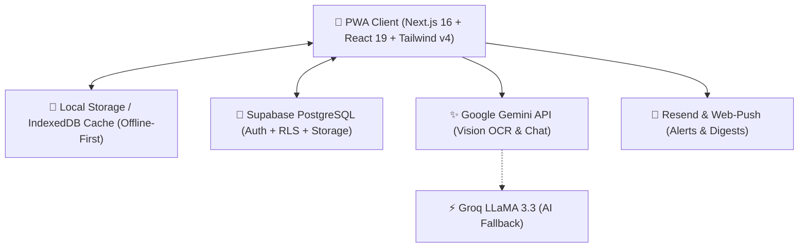

<div align="center">

  

  # 🐢 Pawi: AI-Powered Financial Tracker
  
  **Save smarter, slow and steady.**

  [](https://nextjs.org/)
  [](https://react.dev/)
  [](https://www.typescriptlang.org/)
  [](https://supabase.com/)
  [](https://tailwindcss.com/)
  [](https://ai.google.dev/)
  [](https://web.dev/progressive-web-apps/)
  [](LICENSE)

  <p align="center">
    <a href="https://pawi-finance.vercel.app"><b>🚀 Launch Live Web App</b></a> •
    <a href="#-key-features">✨ Key Features</a> •
    <a href="#-architecture--tech-stack">🛠️ Tech Stack</a> •
    <a href="#-getting-started">⚙️ Getting Started</a> •
    <a href="#-testing--verification">🧪 Testing</a>
  </p>

</div>

---

## 📖 Overview

**Pawi** (named after the Filipino sea turtle *Pawikan*) is a modern, mobile-first, offline-first personal finance application tailored for daily life and Southeast Asian financial ecosystems.

Combining multi-wallet tracking, intelligent financial planning, and a multi-tier conversational AI companion, Pawi transforms personal money management into an enjoyable, gamified, and seamless daily habit.

---

## ✨ Key Features

### 🐢 1. Pawi AI Companion (`/chat`)
* **Context-Aware Assistance:** Chat naturally with Pawi to inspect spending trends, check budget balances, or get personalized savings advice.
* **Multi-Tier AI Engine:**
  * **Tier 1 (Primary):** Google Gemini 3.7 / 2.5 Flash (`@google/generative-ai`)
  * **Tier 2 (Fallback):** Groq API (`llama-3.3-70b-versatile`)
  * **Tier 3 (Offline Engine):** High-personality local rule engine for full offline capability.

### 📸 2. Smart AI Receipt OCR Scanner (`/api/receipt-scan`)
* **Instant Expense Extraction:** Snap a photo or upload a receipt to automatically parse merchant name, grand total, currency, category, date, payment method, and line items.
* **Direct Draft Creation:** Verifies confidence levels and pre-fills transaction entry modals in one tap.

### 💳 3. Philippine-Localized Multi-Wallet Hub (`/wallets`)
* **Automated Brand Styling:** Auto-detects and renders official logos and brand colors for **GCash, Maya, BDO, BPI, RCBC, UnionBank, GoTyme, SeaBank, Metrobank, Wise, PayPal, and Cash**.
* **Liability & Credit Management:** Track credit utilization, limits, interest rates, and inter-wallet fund transfers.

### 🎯 4. Comprehensive Financial Planning (`/plan`)
* **📊 Category Budgets:** Envelope budgeting with real-time spend progress indicators.
* **🎯 Savings Goals:** Milestone-driven goal tracker with target dates and projected completion.
* **💳 BNPL & Installment Tracker:** Monitor installment plans (e.g. SPayLater, LazPay, Credit Card 0% plans) with months paid vs. remaining.
* **🤝 Debts & Receivables (Utang / Pautang):** Track who you owe and who owes you with due dates and settlement statuses.
* **🔄 Recurring & Planned Bills:** Subscriptions (Netflix, Converge, Globe, etc.) and upcoming commitments.
* **✈️ Travel & Event Budgets:** Isolated expense tracking for vacations and special projects.
* **🧮 Financial Calculators:** Built-in compound interest and debt payoff simulators.

### ⏳ 5. Interactive Payday Countdown & Cashflow Forecasting
* Configure semi-monthly (15th / 30th) or monthly salary schedules.
* Live countdown dashboard displaying days remaining and liquidity forecast.

### ⚡ 6. Offline-First & Guest Demo Mode
* **Instant Local Cache:** Full offline access via local persistence and IndexedDB.
* **Guest Sandbox:** Experience all features with rich demo data without mandatory sign-up.
* **Cloud Sync:** Seamless background synchronization to Supabase PostgreSQL when back online.

---

## 🛠️ Architecture & Tech Stack



| Component | Technology | Description |
| :--- | :--- | :--- |
| **Framework** | Next.js 16 (App Router) | React 19, TypeScript, Server & Client Components |
| **Styling** | Tailwind CSS v4, Shadcn, Base UI | Signature Emerald Green UI, dark/light theme |
| **Animations** | Framer Motion | Smooth mobile micro-interactions and transitions |
| **Database & Auth** | Supabase | PostgreSQL with Row Level Security (RLS), Google & Email Auth |
| **Storage** | Supabase Storage | Secure receipt image upload and processing |
| **AI Vision & Chat**| Google Gemini & Groq | Multimodal OCR and context-aware conversational agent |
| **PWA Engine** | `@ducanh2912/next-pwa` | Service Worker caching and home-screen installability |
| **Testing** | Jest & Testing Library | 177 automated test cases across 14 test suites |

---

## 📂 Project Structure

```
├── mobile_app/                  # 📱 Primary Next.js 16 Full-Stack Application
│   ├── app/                     # Next.js App Router (Pages, Layouts, API Routes)
│   │   ├── admin/               # Admin governance & activity monitoring
│   │   ├── api/                 # Backend API routes (Chat, Receipt OCR, Push, Email)
│   │   ├── login/               # Authentication screen (Google / Email / Guest)
│   │   ├── onboarding/          # Interactive user setup flow
│   │   └── page.tsx             # Main application shell with Speed Dial
│   ├── components/              # Reusable UI components & modals
│   │   ├── plan/                # Budgeting, Goals, BNPL, and Debt modules
│   │   ├── screens/             # Core screens (Home, Wallets, Plan, History, Chat)
│   │   └── ui/                  # Base UI components
│   ├── lib/                     # Core business logic, store, auth & engines
│   │   ├── __tests__/           # Jest unit & integration test suites
│   │   ├── auth-context.tsx     # Supabase Auth provider with guest mode
│   │   ├── pawi-data.ts         # Types, starter sets, and brand resolvers
│   │   ├── store.tsx            # Global state management & offline sync
│   │   └── supabase.ts          # Supabase client & admin helpers
│   ├── public/                  # Static assets, brand logos, PWA icons, manifest
│   └── supabase/migrations/     # PostgreSQL schema migrations and triggers
├── android_twa/                 # 🤖 Android Trusted Web Activity (TWA) wrapper
├── assets/                      # 🎨 High-resolution brand assets & illustrations
├── docs/                        # 📚 Visual documentation & screen walkthroughs
└── README.md                    # 📖 Project documentation
```

---

## ⚙️ Getting Started

### Prerequisites
* **Node.js** 18.18+ or 20+
* **npm** or **pnpm** / **yarn**

### 1. Clone the repository
```bash
git clone https://github.com/janveryuu/pawi-financial-tracker.git
cd pawi-financial-tracker/mobile_app
```

### 2. Install dependencies
```bash
npm install
```

### 3. Configure Environment Variables
Create `.env.local` inside `mobile_app/`:
```env
# Supabase
NEXT_PUBLIC_SUPABASE_URL=https://your-project.supabase.co
NEXT_PUBLIC_SUPABASE_ANON_KEY=your-anon-key
SUPABASE_SERVICE_ROLE_KEY=your-service-role-key

# AI Services
GEMINI_API_KEY=your-gemini-api-key
GROQ_API_KEY=your-optional-groq-api-key

# Notifications (Optional)
RESEND_API_KEY=your-resend-key
NEXT_PUBLIC_VAPID_PUBLIC_KEY=your-vapid-public-key
VAPID_PRIVATE_KEY=your-vapid-private-key
```

### 4. Run Development Server
```bash
npm run dev
```
Open [http://localhost:3000](http://localhost:3000) in your browser.

---

## 🧪 Testing & Verification

Pawi includes comprehensive test coverage verifying transaction integrity, anti-spam protections, chat action parsing, home section engines, and plan persistence:

```bash
cd mobile_app
npm test
```

```
PASS lib/__tests__/store-transactions.test.ts
PASS lib/__tests__/anti-spam.test.ts
PASS lib/__tests__/qa-remediation.test.ts
PASS lib/__tests__/plan-persistence.test.ts
PASS lib/__tests__/landing-assets.test.ts
PASS lib/__tests__/home-sections-engine.test.ts
PASS lib/__tests__/chat-action-parser.test.ts
PASS lib/__tests__/chat-action-engine.test.ts
PASS lib/__tests__/admin-auth.test.ts
PASS lib/__tests__/push-engine.test.ts
PASS lib/__tests__/chat-hardening.test.ts
PASS lib/__tests__/onboarding.test.ts
PASS lib/__tests__/realtime-streak.test.ts
PASS lib/__tests__/final-qa-verification.test.ts

Test Suites: 14 passed, 14 total
Tests:       177 passed, 177 total
```

---

## 📄 License
Distributed under the MIT License. See `LICENSE` for details.

---

<div align="center">
  <p>Built with 💚 for financial freedom. <i>Save smarter, slow and steady. 🐢</i></p>
</div>
