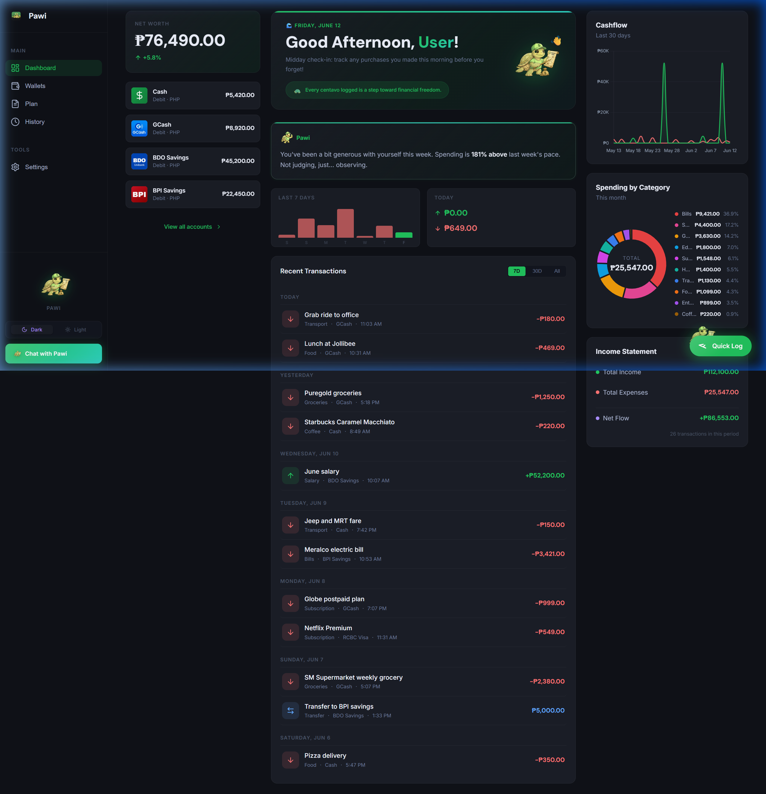
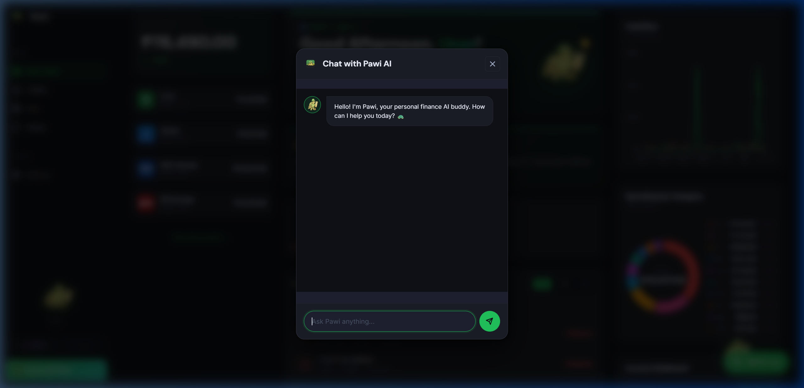
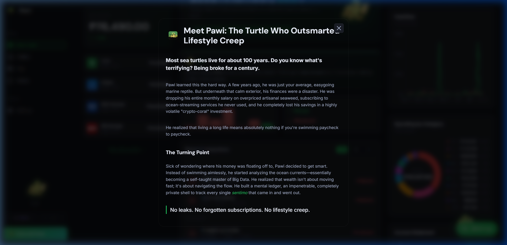
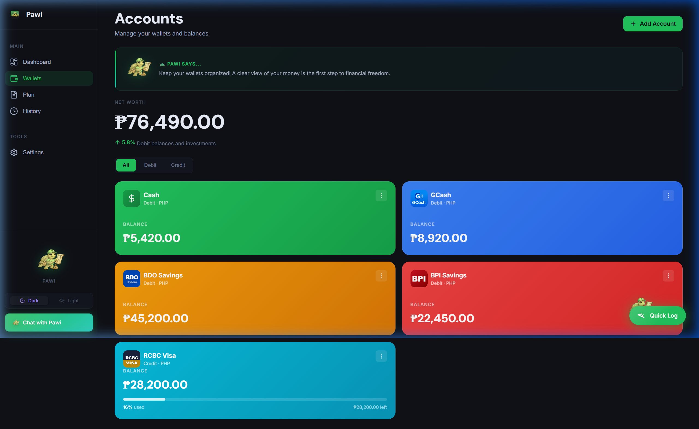
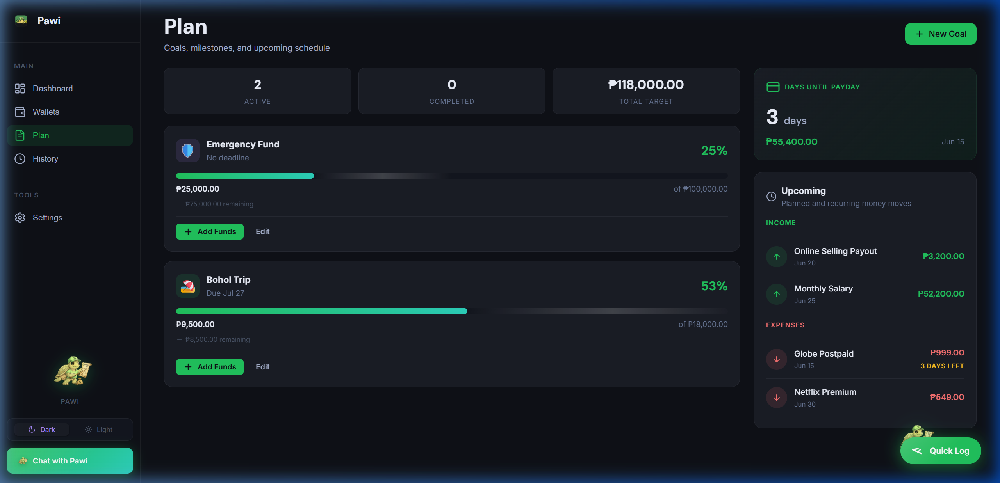
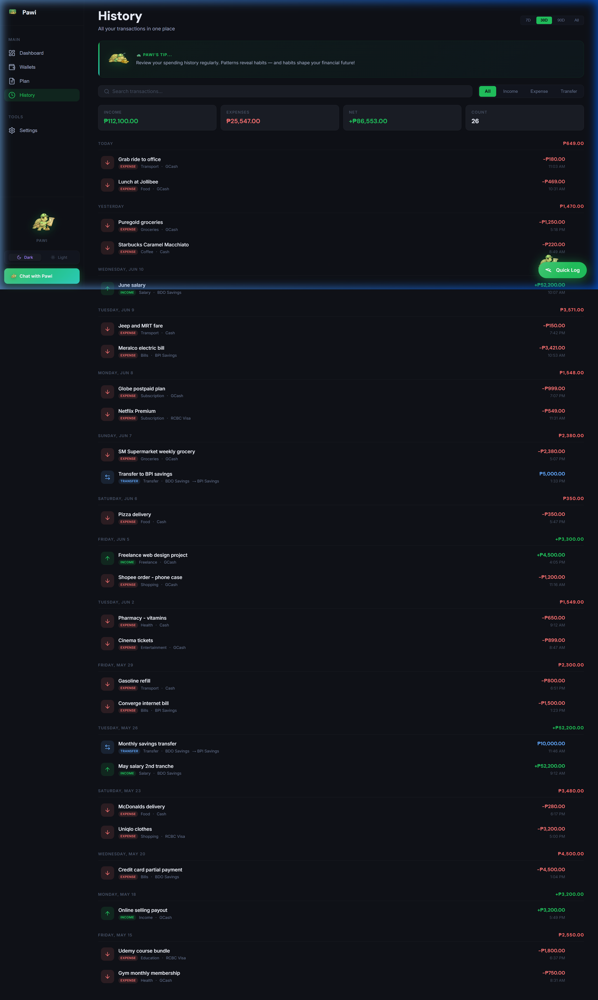

# Sentimo Tracker — App Walkthrough

Welcome to the newly updated **Sentimo Personal Finance Tracker**! 
Here is a comprehensive look at the current state of the application with all the new features we've built, including the premium dark mode, the new custom Pawi mascot integration, and the AI chatbot functionality.

## 1. Dashboard View
The Dashboard gives you a complete overview of your financial health. Notice the new "Chat with Pawi" button in the left sidebar, replacing the old Quick Log!

---

## 2. Pawi AI Chatbot
Clicking the "Chat with Pawi" button in the sidebar brings up the sleek AI Chatbot interface. This replaces the old Quick Log functionality and adds a fun, interactive way to log transactions or ask for financial advice.

---

## 3. Pawi Origin Story
When you click on the bouncing Pawi mascot above the chat button, you get his full backstory modal! This gives the app so much personality while reinforcing the "offline-first" privacy model.

---

## 4. Wallets & Accounts
The Wallets view lets you track multiple accounts (like GCash, BPI, Cash) all in one place, complete with its own dedicated Pawi banner at the top.

---

## 5. Financial Planning
The Plan view helps you set up upcoming recurring bills, track your monthly budget, and forecast your cashflow, ensuring you don't succumb to lifestyle creep.

---

## 6. Transaction History
Finally, the History view provides a complete, searchable log of every transaction you've made, using the updated premium deletion modals rather than ugly browser alerts.

---

### Browser Recording
If you want to see all of these elements in motion, including the smooth transitions and Pawi's happy bounce animation, check out the browser session recording!

